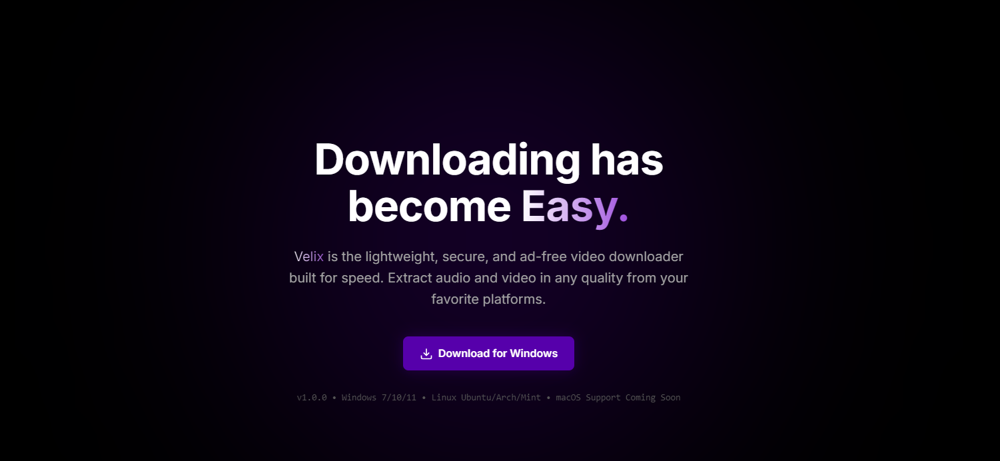
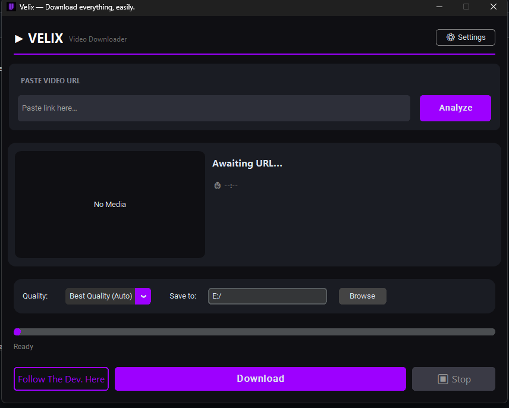

  
  <h1 align="center">Velix Downloader 𝐕🕷️🕸️</h1>
  
Velix is the lightweight, secure, and ad-free video downloader built for speed.

  
  
  
   
  
  

 

  
  
  
  
  

Made possible by <a href="https://bassemmohamed.pages.dev/"><strong>BassemMohamed</strong></a>

Velix is the lightweight, secure, and ad-free video downloader built for speed. Extract audio and video in any quality from your favorite platforms.
Clean interface. High performance. No distractions.

---

## Screenshot

##  Features

- High-speed media downloading 
- Multiple format support (Video & Audio)
- Clean and minimal user interface
- Lightweight and optimized performance
- Built-in update system

---

##  Download

Get the latest version here:

### 

---

##  System Requirements

- Windows 7 / 10 / 11
- Linux Ubuntu / Arch / Mint
- 2GB RAM minimum
- Internet connection required

---

##  Security & Transparency

This software is intended for downloading publicly available or user-authorized content only.

Users are responsible for complying with the terms of service of the platforms they use.

---

##  Built With

- Python
- Yt-dlp
- Customtkinter
- Tkinter

---

##  Version

- Current Version: v1.0.0
- The feature to download a complete playlist has been added. v1.1.0
- Fixed bugs in background state.
- New UI/UX. v2.0.0
- A pause download button has been added. v2.1.0
- The app freezing issue has been fixed and Fixed Bugs. v2.1.2
---

## Security

Velix does not collect personal information.

The application contains:

- No advertisements
- No telemetry
- No analytics
- No background tracking

All downloads are performed locally on the user's device.

## License

This project is licensed under the MIT License.

Velix includes and depends on several third-party open-source projects such as:

- yt-dlp
- CustomTkinter

These libraries remain under their respective licenses.

See the LICENSE file for more details.

